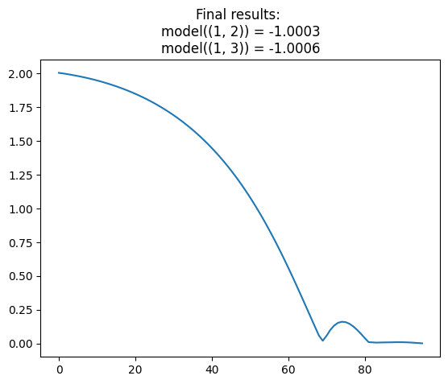
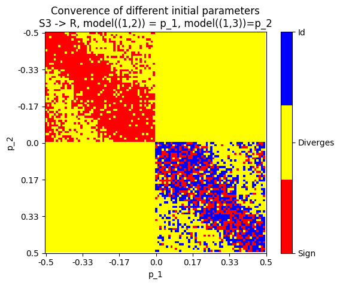
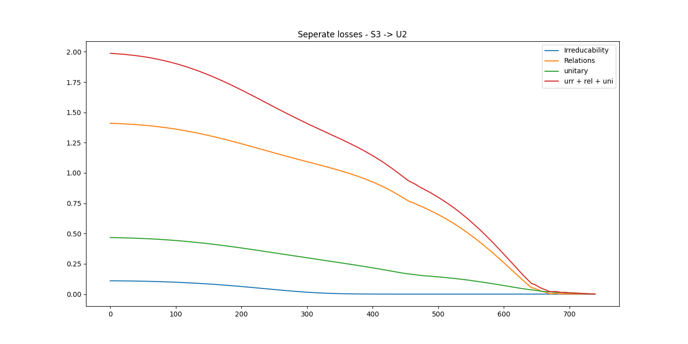
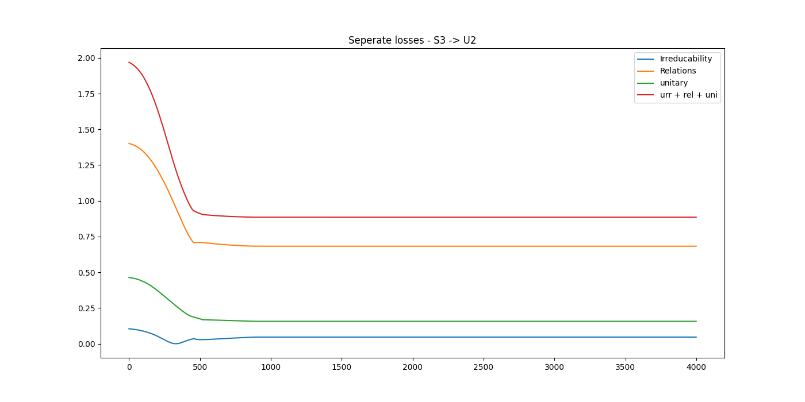
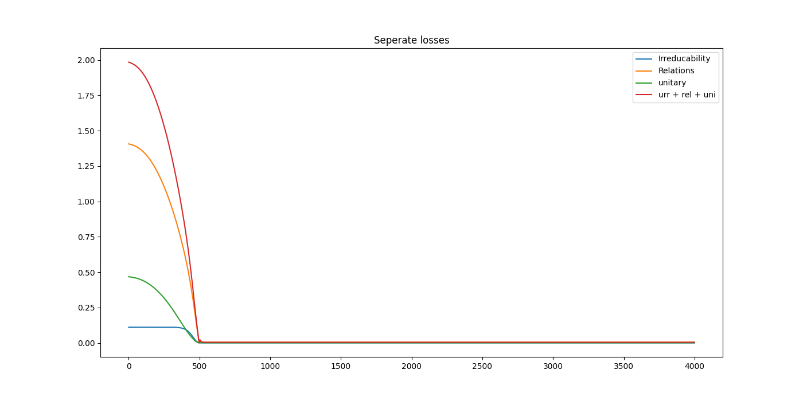

# Instalacija
Poženi
```
pip install -e .
```
iz lokacije, v kateri je ta README. To instalira paket gofi, zraven pa sledi vsem spremembam.

## Simulacije
### Dinamika 1dim D_n - Hitrost konvergence začetnih parametrov (dihedral grid)
Barva pixla pove, kam konvergiramo iz njega. Odtenek  pove, kako hitro konvergiramo. 
Koda za simulacije:
```
python3 gofi/ode/dihedral/expiriments/1_dim_grid.py n min max resolution grid_filename
python3 gofi/ode/dihedral/expiriments/1_dim_grid_plot.py n min max  grid_filename graph_filename
```
### Dinamika 2dim D_n
Trajektorije in verjetnost uspešne konvergence. Koda:
```

```


## Struktura 
- `ode/`  - vse, kar ne uporablja torcha
- `graphs/` - grafi 
   - `graph.py`
      `RelationLoss()`, itd... 
- `actions/` - delovanja
  - `action.py` 
     - `class ActionModel(Group(S,R))` - za vsak generator ima svoj `models.RandomMap()` 
- `repr/` - upodobitve
   - `repr.py` -  `class RepresentationModel`
- `models.py` 
   - `class Group`
   - `class RandomMap`
- `loss.py` 
   - `def UnitaryLoss(Matrix)` 

- ~~`autograd`~~ - **REMOVE!** to bo z zgornjo strukturo obsolete


## Inversion table - overparametrizacija za grafe, ki tvori le permutacije
Ideja: $S_n \cong \prod _{i=n-1}^0 [0, i]$, s homomorfizmom
$$
\pi \mapsto (a_1, a_2, \ldots, a_n),
$$
kjer je $a_k$ enak številu elementov, VEČJIH od $k$, ki se v permutaciji pojavijo levo od $k$. 

Distribucijo nad $S_n$ podamo kot $distribucijo nad vrednostimi $a_1, a_2, ...$ z vektorji 
$$P = [P(a_1 = 0), P(a_1 = 1), \ldots , P(a_1=n-1)], 
[P(a_2 = 0), P(a_2 = 1), \ldots , P(a_2=n-2)], \ldots .$$

Model je poljuben $M \colon \R^{\text{\#params}} \to  \prod _{i=n-1}^0 [0, 1]^i$ ki pretvori parametre $\phi$ v distribucijo $M(\phi) = P$.

**Tvorjenje na ta način je ekvivalentno slednjemu procesu: izbereš eno izmed $n$ možnih mest za $1$ glede na distribucijo nad $a_k$. Nato izbereš mesto za $2$ izmed $n-1$ mesti...**

### Funkcija izgube
Ne rabimo več unitarnosti, zanima nas samo še $P(f(i) \sim f(j)) = \sum_{k \neq h} P(f(i) = k, f(j) = h)$, za katero hočemo, da je čim večja. 

### Implementacija
Recimo, da smo prvih $m-1$ števil že postavili. Imamo še $n-m+1$ praznih mest in postavljamo $m$. prazna mesta oštevilčimo z $1, 2, \ldots, n-m+1$. Označimo s  $P(i, k, j, h, m)$, **kjer je $i <j$** verjetnost, da bomo  tvorili permutacijo, ki ima na $i$-tem mestu (po novih oznakah) $k$, na $j$-tem pa $h$. 

Dodatno s $q(j,h,s)$ označimo verjetnost, da $h$ damo na $j$-to prosto mesto, če smo prvih $s-1$ števil že postavili.

Ločimo  primere:

Če je $m=n$, imamo samo še eno prosto mesto. (Do tega sicer ne moremo priti med tvorjenjem).
$$
P(i, k, j, h, n)=1
$$
Če je $i<=0$ ali $j<= 0$, je $P(i,k,j,h,n) =0$.

Če je $m = k$, moramo k postaviti na $i$-to prosto mesto! Potem pa še $h$ na $j-1$ prosto mesto. **TUkaj je pomembno, da je $i<j$**!
$$
P(i,k,j,h,k) = P(a_k=i) q(j-1,h,k+1)
$$
Podobno, če je $m=h$, postavimo $h$ na $j$-to mesto. V tem primeru se indeks $i$ ne spremeni.
$$
P(i,k,j,h,h) = P(a_h=i) q(i,k,h+1)
$$
Če je $h \neq m \neq k$, potem lahko $m$ postavimo pred $i$, med $i$ in $j$ in za $j$. Velja
$$
P(i,k,j,h,m) = P(i-1, k, j-1, h, m+1) \sum_{z=1}^{i-1} P(a_{m} = z )
+
P(i, k, j-1, h, m+1) \sum_{z=i+1}^{j-1} P(a_m = z )
+
P(i, k, j, h, m+1) \sum_{z=j+1}^{n-m} P(a_m = z ).
$$

Za $q(j,h,m)$ (postavljamo $h$ na $j$to prosto mesto, $m-1$ smo jih že postavili) pa velja
$$
q(j,h,h) = P(a_h = j)
$$
za $m\neq h$:
$$
q(j,h,m) = q(j-1, h, m+1) \sum_{z=1}^{j-1} P(a_m = z) 
+ 
q(j, h, m+1) \sum_{z=j+1}^{n-m} P(a_m = z) .
$$
Seveda veljata robna pogoja
$q(0,h, m) = 0$ in $q(j,h,n) =1$.


Naredimo funkcijo `p(i,k,j,n)`. Loss je vsota logaritmov od  takih za vsako povezavo. 
# TODO
## upodobitve
- zrihtaj kodo za upodobitve Dn
- ko najdeš eno upodobitev u, dodaj v loss pogoj, da je karakter pravokoten na u
- narediš loss kot produkt lossov za različne dimenzije matrik  --> imaš nekaj, kar išče po vseh dimenzijah 
## grafi 
- dodaj avtomorfizme med dvema grafoma
- a, b iz A_n naključno --> cayley graf
- x y druga dva --> cayley graf   
- poglej, če je izomorfizem 
- probaš na vseh cayleyevih grafih A_n glede na dva naključno izbrana elementa 

# Plani za naprej:
- dodaj loss ortogonalnosti na prejšnje upodobitve
- dodaj 
- Ogromne simulacije na calculusu
- Pripravi berljive zvezke


gemini Pro vs chatgbt


# Irreducable representations gradient search
### Implementacija ideje Urbana Jezernika 

**[Povezava do teorije: ](zapiski/teorija.md)**

We have a model 
$$\phi  \mapsto \hat \rho _\phi : G \to \mathbb{F}^{\text{dim} \times \text{dim}}$$
of an unknown irreducable representation $ \rho _\phi : G \to GL_{\text{dim}}\mathbb{F}$.

Using gradient optimisation, we want to change the parameters $\phi \in \mathbb F ^p$ of the model to minimize 
$(1 - ||\chi_{\hat \rho_\phi}||)^2$ and TODO. 

We study, how initial parameters $\phi_0$ effect the convergence/divergence of the optimisation. 
In the future, we might focus on the gradient flow 
$$
\frac{d\phi}{dt} = - \nabla \mathbf{L} (\phi)
$$

## Results
### $\rho \colon S_3 \to \mathbb \R \setminus \{0\}$
The following resoults are found in [src/analysis.ipynb](src/analysis.ipynb).


Example of model $\hat \rho \colon S_3 \to \mathbb R$ converging to $\text{sign} \colon S_3 \to \mathbb R \setminus \{0\}$:

### Different parameters of $\hat \rho_{\phi=(p_1, p_2)} \colon S_3 \to \mathbb R$
Model $\hat \rho $ of $\rho \colon S_3 \to \mathbb R \setminus \{0\}$ is given by 
$$
\hat \rho((1,2)) = p_1 \quad \hat \rho((1,3))=p_2.
$$
Optimising $p_1$ and $p_2$ with adam, learning rate of $0.01$ and $p_1, p_2 \in (-\frac{1}{2},\frac{1}{2})$ yields the following result:

Convergence means that the loss was lower than $\varepsilon = 0.001$. Divergence means that the run didn't converge in 400 steps. 
If loss is small, $\phi=(p_1, p_2) \approx (1,1)$ (converges to $\text{id}$) or $\phi=(p_1, p_2) \approx (-1,-1)$ (converges to $\text{sign}$).

### Irreducability search for $\rho \colon S_3 \to GL_2 \mathbb R$ and $\rho \colon S_3 \to GL_2 \mathbb C$


Some results:





# TODO
- izpelji na roko za 1dim, 2dim in lepe G= S_n, D_n, C_n
- testiraj Sn na R \to 2x2


